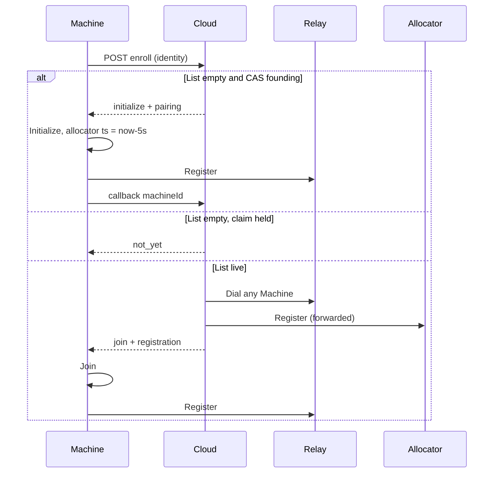

# Cloud enroll founds one Cluster per token; Allocator is a quiet cluster KV row

Copy-paste `ployz init --cloud` founds or joins through Cloud. Cloud CAS-claims an empty Relay List so only one Machine Initialize; waiters get `not_yet` until List is live, then join. Machine Subnets are assigned by the Machine named in `cluster.allocator`. A stolen Allocator row must be 5s old before it may Register; a solo founder writes that row already 5s in the past so the first joins are immediate. A Machine that sees more than three Machines, all uncontactable, refuses admit and steal. Cloud Dials any held Register and that Machine forwards `Register` to the Allocator.

Rejected: `ployz join`, Cloud IPAM, steal on Membership Observation Down, min-ID Register target, reclaiming a Founding Claim without rotating the Pairing Credential.

## Paste

```sh
curl -fsSL https://ployz.sh | sh && sudo ployz init --cloud 'pmet_…'
```

`--cloud-url` is optional and defaults to `ployz.dev` (HTTPS). `ployz machine init HOST` and `ployz machine add HOST` stay SSH break-glass.

## CLI

```
ployz init --cloud <token> [--cloud-url ployz.dev]
```

Local, this Machine. Requires `--cloud`. Talks to local `ployzd` (install if needed).

Flags that still apply: `--name`, `--network` (default `10.210.0.0/16`), `--no-caddy`, `--no-dns`, `--yes`, `--wg-mtu`. No destination, no SSH key.

Enroll URL is `https://<cloud-url>/api/enroll/<token>`. Host without a scheme is HTTPS.

Loop: POST identity, honor `not_yet` (`retryAfter` seconds, default 2), until `initialize` or `join`. A waiter that sits through a dead founder gets `initialize` when the 5-minute Founding Claim expires.

Hosted DNS: unless `--no-dns`, Cloud reserves a domain under the same Cloud host after the founder is live. Do not call `dns.uncloud.run` from this command.

## Cloud lock (founding)

There is no Cluster store yet, so the lock is Cloud.

Token row: `open` → `founding` → `live`.

```
POST /api/enroll/<token>
body: { name, publicKey, advertisedEndpoints, publicIp }
```

On each POST, in this order:

1. Relay List for this pairing nonempty → `live` if needed, then `join` (never Initialize).
2. `founding`, same public key, claim younger than 5 minutes → `initialize` with the **same** pairing (crash retry).
3. `founding`, claim younger than 5 minutes → `{ kind: "not_yet", retryAfter: 2 }`.
4. `founding`, claim older than 5 minutes, List still empty → **revoke that Pairing Credential**, CAS `founding` → `open`, then this POST takes the new claim: `{ kind: "initialize", pairing }` with a **new** pairing.
5. `open` → CAS `open` → `founding` (5-minute TTL) → `{ kind: "initialize", pairing }`.

Reclaim without rotating pairing is two Clusters on one tenant. A late first founder fails Relay Register (revoked), retries enroll, and `join`s the winner (or wins the next claim). If it already Initialized locally, `Reset` then POST again.

`live` when Relay List is nonempty, or on callback. Callback is UX, not the lock:

```
POST /api/enroll/<token>/callback
body: { machineId }
```

`join` means Cloud Dials any held Register, that Machine forwards `Register` with the POST body, Cloud returns `{ kind: "join", pairing, registration }`. If every Dial/`Register` fails with a retryable Allocator error, respond `not_yet`.

## Local `initialize`

Fixes the UT-049 stub for the Cloud path.

1. `Inspect`. If not uninitialized, confirm and `Reset` (`--yes` skips confirm).
2. POST enroll until `initialize` or `join`.
3. **`initialize`:** `Initialize` with name, network, endpoints, optional pairing. Restart. On Corrosion up: publish machine, `cluster.network`, and `cluster.allocator = me` with `updated_at = now - 5s`. Relay Register. Callback. Optional hosted DNS and Caddy.
4. **`join`:** `Join` with the returned `registration` (and persist pairing). Catch-up. Relay Register.

Pairing is stored with the local record so every participating Machine dials Relay. `InitializeRequest` / `JoinRequest` carry optional Cloud Pairing.

A Machine that already Initialized and then hits a revoked pairing (Founding Claim expired under it) must `Reset` and POST enroll again: `join` if List is live, else it may win the next claim.

## Allocator

Cluster KV key `allocator`, value = Machine ID. `updated_at` is the quiet clock.

**May Register (admit)** only if all of:

- local KV names this Machine
- `now - updated_at >= 5s`
- not isolation-locked

**Solo founder** writes `updated_at` **5 seconds in the past** (`datetime('now', '-5 seconds')`). Same gate, already satisfied. First joins do not wait.

**Steal** writes `allocator = me` with `updated_at = now` (not backdated). Failover waits ~5s so Corrosion LWW can pick a winner (p99 ~1s). Losers see they lost and forward.

Same-process: hold `machine_publication` across snapshot + `allocate_machine_subnet` + publish. Cross-process: the quiet row, not a mutex.

### Isolation lock

If the local machines replica has **more than 3** Machines **and** Membership Observation says every other Machine is uncontactable: refuse admit **and** refuse steal-to-self.

Mesh membership, not Relay. An island on Cloud Relay still cannot steal while the real Allocator is alive.

Does not fire for 1–3 Machines (bootstrap). Does not fire on a 50/50 split (each side still sees peers). Those overlaps stay UT-140-class.

### `register()`

Cloud Dials any live Machine. That `ployzd`:

```
read local allocator
if isolation-locked: refuse
if kv == me and quiet: lock publication; snapshot; allocate; publish; return
if kv == me and not quiet: retryable "not quiet"
if kv == other: RPC Register there (one hop)
on RPC fail: re-read
  if now reachable: forward
  if isolation-locked: refuse
  else steal (write me, now); retryable "not quiet"
```

Forward once. The named Allocator runs locally only if its own KV still names it. Cloud retries another List entry on isolation / unreachable; on "not quiet" the enroll POST returns `not_yet`.

Steal on Register RPC failure after re-read, **not** on Membership Observation Down.

### Missing Allocator row

If the key is missing: a participating Machine that is not isolation-locked may steal (`updated_at = now`). Founder init should have written it; this is repair.

## Out of scope

- No `ployz join`, no `machine add --enroll`.
- No Cloud IPAM. Cloud never assigns `/24`s.
- No long-poll. `not_yet` + retry.
- No majority quorum. 50/50 mesh split can still dual-allocate.
- Machine Subnet may still overlap (CONTEXT). This makes the copy-paste happy path and same-partition failover not overlap.


