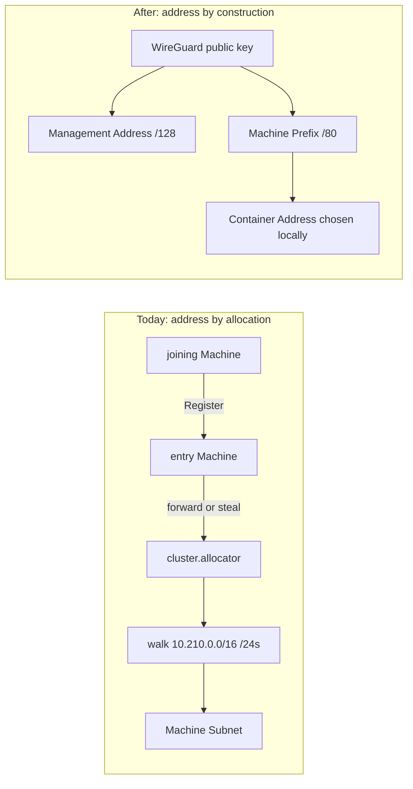
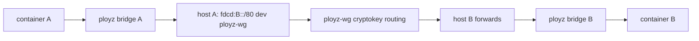

# Machine Prefix is derived from the WireGuard key; Allocator and Machine Subnet are deleted

Ployz keeps Uncloud `misc/design.md`: equal Machines, AP, operate each partition, heal later. It stops copying Uncloud's unique IPv4 `/24` pool and the Allocator Ployz added on top. A Machine's container space is a function of its own key, never a grant.

Status: proposed.

## Decision

Every cluster-routable identity is a pure function of identity that is already unique by construction — the Machine's WireGuard public key — plus bits the creating Machine chooses locally. Nothing cluster-routable is taken from a shared pool. Docker IPv4 stays Machine-local and may overlap. Join and Deploy do not consult a coordinator.

## Unrepresentable

`CODING_STANDARDS.md`: a type cannot represent an illegal state. Two Machines holding the same Machine Subnet is a cluster-wide invariant no local type can hold. Delete the resource. Do not add a better check.

Deleted types and values:

1. `MachineSubnet`. The `Machine` value loses `subnet`. Overlap has no encoding.
2. The Cluster IPv4 pool (`10.210.0.0/16`), founder `--network`, `FoundingCluster.network`, and the `cluster.network` row. No pool means nothing to allocate from.
3. `ContainerAddress` as IPv4. It becomes IPv6, constructed only from a Machine Prefix plus a Machine-local suffix. No IPv4/IPv6 enum that can smuggle a cluster IPv4 back in.
4. Stored `Machine.management_address` and `ManagementAddressMismatch`. Management Address is a function of the public key, so storing it beside the key is the desyncable pair the standard forbids.
5. `AllocatorRow`, `cluster.allocator`, founder claim, steal, quiet bit, Register-forward.
6. `NotAllocator`, `AllocatorNotQuiet`, `NoFreeSubnet`, `InvalidClusterNetwork`.
7. `IsolationLocked` as a Register refusal. It is Uncloud's "do not proceed in a minority partition" TODO made real. Without a scarce assignment, isolation is not a reason to refuse a join.
8. WireGuard allowed-IPs of a peer IPv4 `/24`. Docker bridge IPAM that *is* the Machine Subnet.

Same public key on Register is the existing Machine (idempotent), not an address grant. Same Machine Name with a different key is Name Ambiguity: admit both, do not repair.

## Addressing

Two disjoint ULA markers. Reusing `fdcc::/16` for containers would let a Container Address land on a Management Address and force a runtime exclusion check. A second marker costs one extra allowed-IPs entry — the same count as today — and deletes the check.

| Bytes 0–1 | Rest | Result |
|---|---|---|
| `fdcc` | key bytes 0–13 | Management Address `/128` (unchanged derivation; no longer stored) |
| `fdcd` | key bytes 0–7 | Machine Prefix `/80` |
| | 48-bit suffix chosen by the creating Machine | Container Address `/128` |

| Address | Family | Who picks it | Uniqueness |
|---|---|---|---|
| Local Container IPv4 | IPv4 | Docker on this Machine | Machine-local. Overlap across Machines is expected. |
| Machine Prefix | IPv6 `/80` | derived from this Machine's public key | by construction (64 bits of key) |
| Container Address | IPv6 | creating Machine during Deploy, inside its prefix | by construction |
| Machine Gateway | IPv6 | first address of the Machine Prefix | by construction |
| Management Address | IPv6 `/128` | derived from this Machine's public key | by construction |

The prefix exists the moment the keypair exists — before Register. The creating Machine is the only assigner inside its prefix, so suffix uniqueness is local bookkeeping. Suffix mechanism (counter, random, MAC-derived) is not a domain fact.

A Machine Prefix is a function, not a record. It is never written to the store, never sent as its own field, never editable. Observers recompute it from the Machine row's public key.

## Routing

Same-Machine traffic stays on the `ployz` bridge, either family.

Cross-Machine container traffic is IPv6 only:

1. WireGuard allowed IPs per peer are exactly two derived entries: Management Address `/128` and Machine Prefix `/80`. Both are a function of the peer's public key.
2. Host routes follow those two entries onto `ployz-wg`.
3. A Machine does not transit traffic between two other Machines. Ingress on `ployz-wg` is accepted only for this Machine's own prefix, then delivered onto this Machine's bridge.
4. Cross-Machine IPv4 does not exist. That is why Local Container IPv4 overlap is not a bug. Outbound internet IPv4 keeps Docker masquerade.
5. The `ployz` Docker network stays a local bridge and becomes dual-stack: IPv6 subnet is the Machine Prefix in routed gateway mode; IPv4 keeps Docker's own default pool. `trusted_host_interfaces = ployz-wg` stays. `DockerNetworkConflict` still refuses to replace a live network; it compares an IPv6 subnet now.
6. No eBPF in this datapath. eBPF earns its keep when the address on the wire does not name its Machine. Once the locator is in the prefix, longest-prefix match and WireGuard cryptokey routing are the whole path. eBPF stays where `misc/design.md` filed it: later, for policy and Service virtual IPs.
7. Duplicate allowed-IPs prefixes silently blackhole in WireGuard. Derived prefixes cannot collide by concurrency, which is the operational reason overlap had to become unrepresentable.

This is a `ployzd` change (network plane, Docker network, firewall, DNS family, Ingress upstreams, store schema, RPC errors). `ployz` loses `--network` and learns nothing new.

## Join and Deploy

Join with one reachable Machine in the partition, or found a network with none:

1. The joining Machine generates its keypair locally. Management Address, Machine Prefix, and Machine Gateway are settled before it has spoken to anyone.
2. It mints its own Machine ID. Nothing grants identity.
3. Register is an introduction: name, public key, endpoints. It returns store bootstrap. It does not walk a CIDR, forward, steal, wait for quiet, or refuse a minority.
4. The Machine publishes its own row. Every observer derives peer addresses from the row's public key and installs two allowed-IPs plus two host routes.

Deploy talks to the target Machine, creates the Service Container, handles errors, returns:

5. Docker assigns Local Container IPv4. The daemon assigns a Container Address inside this Machine's prefix. Both spaces belong to the Machine executing the command.
6. Nobody is consulted for an address. A failed create has no address to release.

## Internal DNS and Ingress

1. Internal DNS Answer is a TTL-zero AAAA of observer-visible Container Addresses. No cluster A record: an A for another Machine would be a non-unique, unroutable Local Container IPv4.
2. Nearest DNS Selector orders addresses inside the observing Machine's Machine Prefix first.
3. Caller Project matches the query source to exactly one visible Service Container. IPv6 matches Container Address. If a later Machine-local A answer exists, IPv4 matches Local Container IPv4 on this Machine only.
4. Ingress Proxy upstreams are Container Address plus port over IPv6. Public Ingress on the public side is unchanged.

## Partition

A admits C; B admits D; both sides Deploy; then heal.

During the partition each joiner already has a key, so each already has a prefix. DNS and Ingress follow what that partition can see.

On heal, Machine and container observations union. Every observer derives the new prefixes and installs peers. Addresses minted during the partition stay valid.

Ugly and accepted: Name Ambiguity, Hostname Owner flipping until observations match, DNS answer sets growing.

Cannot happen: overlapping prefixes from concurrent allocation, renumber, rewind, Allocator election, unique-`/24` repair.

If one physical machine Registers through both partitions with the same key, two rows can exist until gossip settles. They carry the same derived addresses. That is a listing wart, not an addressing conflict.

Pre-release Clusters that already published Machine Subnets reset and re-join. Renumbering live containers is the repair this decision deletes. Implementation needs a narrow greenfield contract exception in `CODING_STANDARDS.md`: lockstep `ployz`/`ployzd`, no compatibility aliases.

## Glossary

**Delete:** Machine Subnet. Allocator.

**Rewrite:**

**Container Address**:
The IPv6 address one Machine gives a container inside that Machine's Machine Prefix. Unique by construction, never granted. Only the container's own Machine chooses one.
_Avoid_: Management Address, Local Container IPv4, allocated container address

**Machine Gateway**:
The Machine-local IPv6 gateway, derived as the first address of the Machine Prefix. Never granted.
_Avoid_: Management Address, allocated gateway

**Management Address**:
The IPv6 used to reach a Machine's management plane over the mesh, derived from that Machine's public key. Not stored beside the key. Distinct from container, gateway, and endpoint addresses.
_Avoid_: Container Address, public endpoint, allocated address

**Machine ID**:
The durable opaque identity of one Machine, minted by the Machine it identifies and never granted by another Machine. Distinct from Machine Name. Uniqueness is within one Cluster and one Pairing Credential's slots.
_Avoid_: Machine Name, granted identity, admitted identity

**Internal DNS Answer**:
An observer-local, TTL-zero AAAA answer derived from replicated healthy Service Container observations and optionally filtered by this Machine's Membership Observations. Not Cluster truth.
_Avoid_: Service registry record, A answer as cluster identity

**Nearest DNS Selector**:
Orders addresses inside the observing Machine's Machine Prefix before other addresses. Prefix locality, not measured reachability.
_Avoid_: closest Machine, subnet locality

**New:**

**Machine Prefix**:
The IPv6 `/80` within which one Machine addresses its containers. Derived from that Machine's public key (`fdcd:` + 8 key bytes), never granted, never stored.
_Avoid_: Machine Subnet, allocated prefix, cluster pool, namespace

**Local Container IPv4**:
The IPv4 Docker assigns on this Machine. Meaningful only with its Machine. Expected to match addresses on other Machines.
_Avoid_: Container Address, overlap as a defect

## Extension

Any future field or KV row whose value answers "which Machine may assign?" fails the deletion test. Prefix derivation may depend only on the address format and `WireGuardPublicKey`, never on observations, a free-list, or a KV value.

When tempted:

1. Need a new cluster-routable identity? Derive it from a key or an id the creating Machine already has.
2. Need locality? Machine Prefix match, or same Machine ID. Not a shared IPv4 subnet.
3. Need to heal a split? Merge observations. Do not renumber.
4. Need uniqueness? Construction. Not a pool.
5. Need a coordinator? Stop.

Capacity growth changes the derivation constants (take more key bytes, or a longer suffix) in an explicit protocol version. It does not add a second prefix selected from observed free space.

## Out of scope

1. ACLs and per-Project isolation.
2. Service virtual IPs (still later, per `misc/design.md`).
3. Replacing WireGuard, NAT traversal, or Management Address derivation (the function stays; the stored field goes).
4. Kubernetes namespaces, CNI, cluster IPAM APIs.
5. Cluster-wide IPv4 `.internal` A answers.
6. Same-Machine A answers (Machine-local, addable later, no coordination).
7. A Container Address that survives recreate (Machine-local if ever wanted).

## Considered options

Rejected: random or hashed IPv4 `/24`s (keeps the type); CRDT claims on `/24`s (AP plus scarcity equals renumber on heal); a "proper" allocator lease (fencing is CP); flat per-container `/128`s (mesh churns per container); stored-random ULA prefix (desyncable field); eBPF over overlapping IPv4 (the map key is the deleted resource); NAT to Management Address (ports become the pool); `/48` from 32 bits of key (birthday risk reintroduces overlap-as-bug); `/112` with a 16-bit suffix (manufactures a capacity ceiling and a mandatory eBPF surface).

## Arena record

Base: candidate D (derived `/64`, no eBPF, pool deleted at every site, isolation lock and stored Management Address removed).

Grafted: candidate A's `/80` (64 bits of key) and duplicate-key heal case; candidate B's extension guardrails and no-transit rule; candidate C's maintainer checklist and dual-family Caller Project.

Dropped: eBPF as the reachability path; keeping isolation lock "for later"; 32-bit `/48` prefixes.
