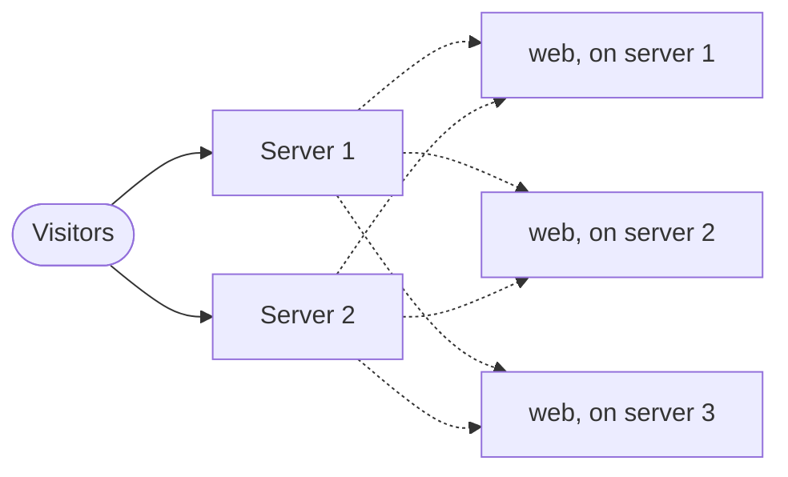

When one copy of your app isn't enough, run more. Each copy is a replica, and Ployz spreads
replicas over your servers. Think of your servers as one pool: a visitor can land on any of
them, and that server hands the request to a healthy replica wherever it runs.



## Run more replicas

1. Open your service and go to **Settings → Scale**.
2. Set **Replicas**, up to 50.
3. Click **Deploy**.


Ployz gives each server one replica before any server gets a second. A replica that crashes or
fails its [health check](settings.md#healthcheck) gets no traffic until it recovers.

**CPU limit** and **Memory limit** in the same section cap what each replica can use. Ployz
doesn't check that a server has room for them, so leave some headroom.

## Add a server

1. [Add a server](../servers/add-a-server.md). It joins your other servers and takes web
   traffic, like the rest.
2. Deploy again to spread your replicas onto it. Replicas only move when you deploy, and the
   dashboard's **Deploy** needs a staged change, so for now this takes the CLI:

   ```sh
   ployz deploy
   ```

To see what runs where, open a server on the **Servers** page. **Running here** lists its
services.

## Give servers different jobs

Every server runs builds, runs services and takes web traffic. Turn jobs off to split the
work, for example a build server that keeps builds away from your app, or a database server
the internet can't reach. **Run builds here** is on each server's page; the other two are
CLI-only for now:

```sh
# A build server: no services, no web traffic
ployz server set builder-1 --accepts-services=false --accepts-ingress=false

# Databases and workers: no public traffic
ployz server set db-1 --accepts-ingress=false
```

For a build server, also turn off **Run builds here** on your other servers. Running replicas
move on your next deploy, or right away with `ployz server drain builder-1` (see
[Change what a server does](../servers/manage-servers.md#change-what-a-server-does)). Keep services on for a server that holds a volume: the services that
use it can only run there. Turning web traffic off drops the server from your generated addresses
but keeps it serving anyone who reaches it directly; to keep the internet out, also close ports 80
and 443 in its firewall.

## When a server goes down

> [!WARNING]
> Ployz has no automatic failover. A database lives on one server: while that server is
> down, so is the database, and if the server is lost, so is its data. Keep your own
> [backups](databases.md#back-up-a-database).

The **Servers** page shows the server **Offline**. Replicas on your other servers keep
serving, though some requests are slower for a while, and for up to an hour some visitors may
still be sent to the offline server. Services that ran only there are down.

To bring services back:

1. Deploy the services that don't use a volume on the offline server. They start on your other
   servers:

   ```sh
   ployz deploy web worker
   ```

   Use the CLI and name them: a deploy that includes a service whose volume is on the offline
   server fails before it changes anything, and the dashboard's **Deploy** includes every
   service.
2. When the server comes back, its replicas start again. Your next deploy tidies up the extras.
3. If it's gone for good, [remove it](../servers/manage-servers.md#remove-a-server) with
   `ployz server rm web-2 --no-reset --confirm web-2` (Ployz can't reach it to reset it), then
   restore its databases from your backups.

## Good to know

- **A service with a volume runs one replica**, on the server that holds the volume. See
  [Volumes](volumes.md).
- **Nothing scales on its own.** There's no autoscaling: you choose the number of replicas.
- **Preview environments run one replica** of each service, whatever you set here.
- **Update your own A records.** If your custom domain's root points at your servers with A
  records, change them when you add or lose a server that takes web traffic. Generated
  addresses and CNAME records follow along on their own. See
  [Domains](domains.md#point-dns-at-your-servers).
